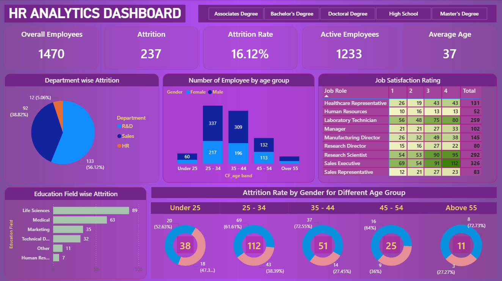

# 📊 HR Analytics Dashboard

## 🧾 Overview
This project showcases an interactive HR Analytics Dashboard built using Power BI.  
It focuses on analyzing employee data to identify attrition trends, workforce distribution, and job satisfaction insights.

---

## 🎯 Objectives
- Analyze employee attrition patterns  
- Understand department-wise performance  
- Study employee demographics  
- Evaluate job satisfaction across roles  

---

## 📁 Dataset
- Source: HR dataset (Excel)  
- Includes employee details like age, gender, department, education, and attrition  

---

## 📊 Key Metrics
- **Total Employees:** 1470  
- **Attrition Count:** 237  
- **Attrition Rate:** 16.12%  
- **Active Employees:** 1233  
- **Average Age:** 37  

---

## 📌 Features
- Department-wise attrition analysis  
- Age group & gender distribution  
- Job satisfaction rating by role  
- Education field-wise attrition insights  
- Interactive slicers for dynamic filtering (e.g., education level)  

---

## 🛠 Skills & Tools
- **Data Visualization:** Power BI  
- **Data Handling:** Excel  
- **Data Processing:** Power Query  
- **Concepts Used:** Data Cleaning, KPI Creation, Dashboard Design  

---

## 📂 Project Files
- `HR Data.xlsx` – Dataset  
- `HR_Analytics.pbix` – Power BI file  
- `Dashboard.png` – Dashboard screenshot  

---

## 💡 Key Insights
- Highest attrition observed in R&D department  
- Employees aged 25–34 show higher attrition  
- Sales roles show varying satisfaction levels  
- Life Sciences field has the highest attrition  

---

## 📸 Dashboard Preview

