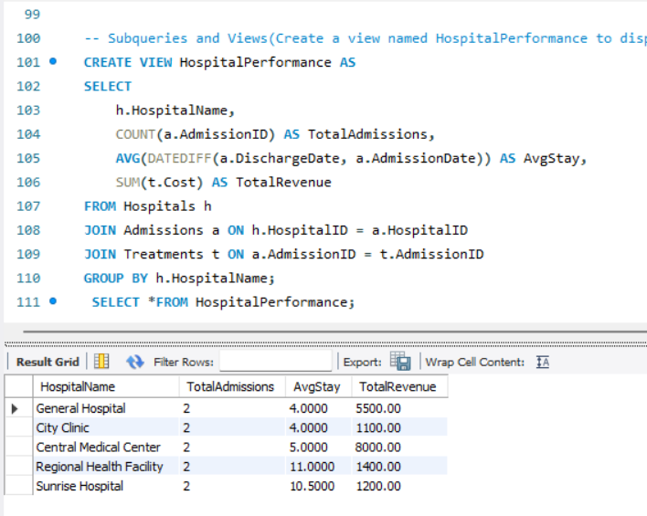
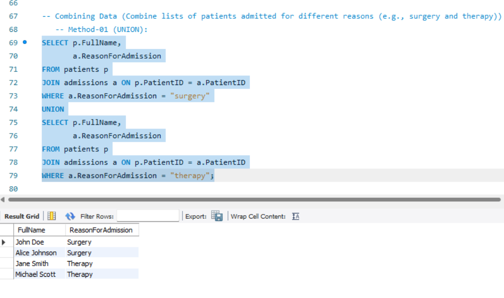
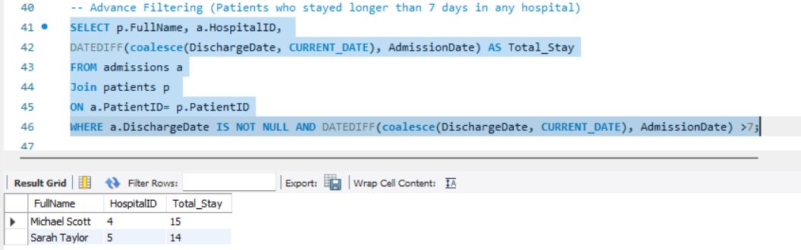
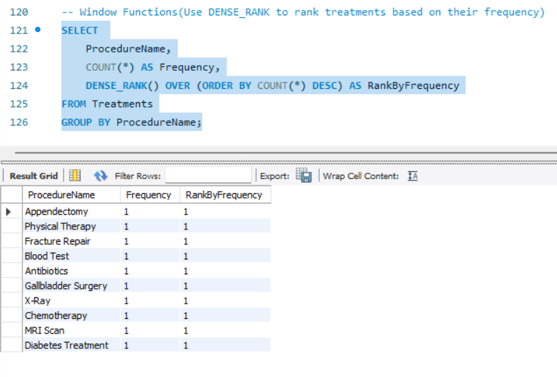

# 🏥 Healthcare SQL Analytics Project

---

## 📌 Overview

A structured SQL project that models and analyzes real-world healthcare data. It covers relational database design, data insertion, and a range of queries — from basic aggregations to advanced subqueries, views, and window functions — to extract meaningful insights across patients, hospitals, admissions, and treatments.

---

## 🛠️ Tools & Technologies

| Tool | Purpose |
|------|---------|
| MySQL | Database engine |
| SQL | Querying, aggregation, views, subqueries |

**SQL concepts used:** JOINs · Aggregations · Subqueries · Views · Window Functions · UNION · Advanced Filtering

---

## 📂 Database Schema

| Table | Columns |
|-------|---------|
| **Patients** | patient_id, name, age, gender, city, blood_type |
| **Hospitals** | hospital_id, name, location, capacity, department |
| **Admissions** | admission_id, patient_id, hospital_id, admit_date, discharge_date, reason |
| **Treatments** | treatment_id, admission_id, procedure, cost, outcome |

---

## 📊 Key Analyses Performed

- Patient demographic analysis (age, gender, city distribution)
- Hospital utilization and capacity tracking
- Treatment cost evaluation across hospitals
- Length of stay analysis per admission
- Advanced filtering using `WHERE`, `HAVING`, and `CASE`
- Subquery-based insights for comparative metrics
- View creation for simplified, reusable reporting
- Combining datasets using `UNION`
- Window functions for ranking and running totals

---

## 🔍 Highlight Queries & Outputs

### 1️⃣ Hospital Performance Analysis — `VIEW`

Creates a view named `HospitalPerformance` to display total admissions, average stay, and total revenue per hospital.

---

### 2️⃣ Combining Patient Lists — `UNION`

Combines lists of patients admitted for different reasons (surgery and therapy) into a single result set.

---

### 3️⃣ Advanced Filtering — `WHERE` + `DATEDIFF`

Retrieves patients who stayed longer than 7 days in any hospital using `DATEDIFF` and `COALESCE`.

---

### 4️⃣ Window Function — `DENSE_RANK`

Ranks all treatment procedures by frequency using `DENSE_RANK() OVER`.

---

## 📄 Project Documentation

Detailed problem statement and dataset reference: [View Document](Docs/HealthcareAnalytics.pdf)

---

## 🚀 Key Learnings

- ✅ Built a normalized relational database from scratch
- ✅ Applied multi-table JOIN operations (INNER, LEFT)
- ✅ Used aggregation functions (`SUM`, `AVG`, `COUNT`) for analytical insights
- ✅ Implemented subqueries for layered, comparative problem solving
- ✅ Created reusable SQL views for simplified reporting
- ✅ Understood practical differences between `UNION`, `IN`, and `JOIN`
- ✅ Applied window functions for ranking and cumulative metrics
- ✅ Used `WHERE` vs `HAVING` for pre- and post-aggregation filtering

---

## 📌 Conclusion

This project demonstrates how SQL can transform raw healthcare records into actionable clinical and operational insights from tracking hospital revenue trends to identifying high-cost treatment patterns reflecting real-world data analytics workflows.

---

> 💡 *Feel free to fork this project and extend it with stored procedures, triggers, or a connected dashboard using Power BI / Tableau.*ject and extend it with stored procedures, triggers, or a connected dashboard using Power BI / Tableau.*
